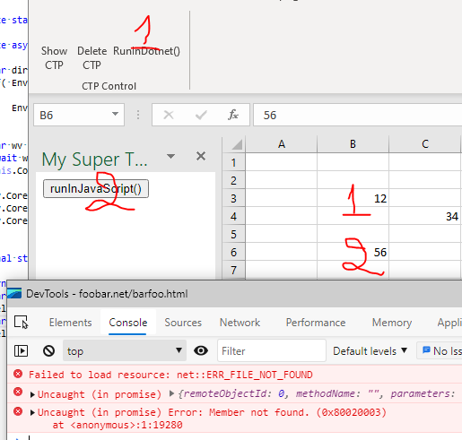

# Test project to demonstrate keyboard focus issue with ExcelDNA + TaskPane + WebView2

cf. issue at https://github.com/MicrosoftEdge/WebView2Feedback/issues/933  

0) Open an empty Excel file  
1) Click show task pane  
2) Test that the arrow keys/page up|down/etc. are still moving the Excel's cursor in the worksheet  
3) Click the WebView2 so it takes control  
4) Back to (2), the arrow keys/page up|down/etc. are still moving the WebView's page, but not the Excel's cursor anymore  
5) Focus on another window and go back, everything is back to normal (2)  

