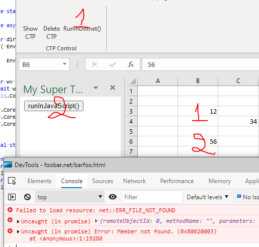

# Test project to demonstrate issue with Excel COM object when used by JavaScript as hostObject in a WebView2 control
The demo project is at [./CustomTaskPane/](./CustomTaskPane/)

1) When the little automation script is run from C#, the execution successfully completes  
   (cf. `RunInDotnet()` in `ContentControl.cs`)  
2) When the same automation script is run from JavaScript,  
   (cf. `runInJavaScript()` in `barfoo.html`)  
   the execution fails with  
   ```
    VM6:2 Uncaught Error: Member not found. (0x80020003)
   ```  

